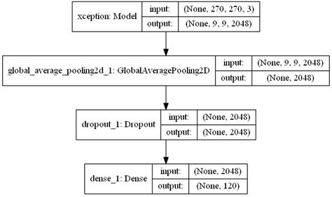

# 狗品種辨識 App
#### 將深度學習分類模型結合 Android App 預測狗的品種，可預測 120 種不同的品種

## 功能
:o: 可選擇手機媒體庫之圖片  
:o: 可利用手機鏡頭即時拍攝  
:o: 提供前三個機率最高之品種的準確率  
:o: 提供各品種之簡介  
:o: 提供 wiki 連結  

## Demo
 

## 模型訓練
### Dataset
[來源](https://www.kaggle.com/miljan/stanford-dogs-dataset-traintest)
### 物件偵測
利用 YOLO V2 擷取圖片中狗的位置進而做分類  
利用 Darkflow 訓練  
:pushpin: 如何使用 Darkflow 可參考[這篇](https://github.com/andy1000335/train_YOLO_tutorial)  
:pushpin: 如何取得 YOLO 輸出可參考[這篇](https://github.com/andy1000335/get_YOLOv2_output)
### 分類
使用 Xception，模型架構如下  
  
經過 50 個 epoch，在測試集可得 90% 的準確率
